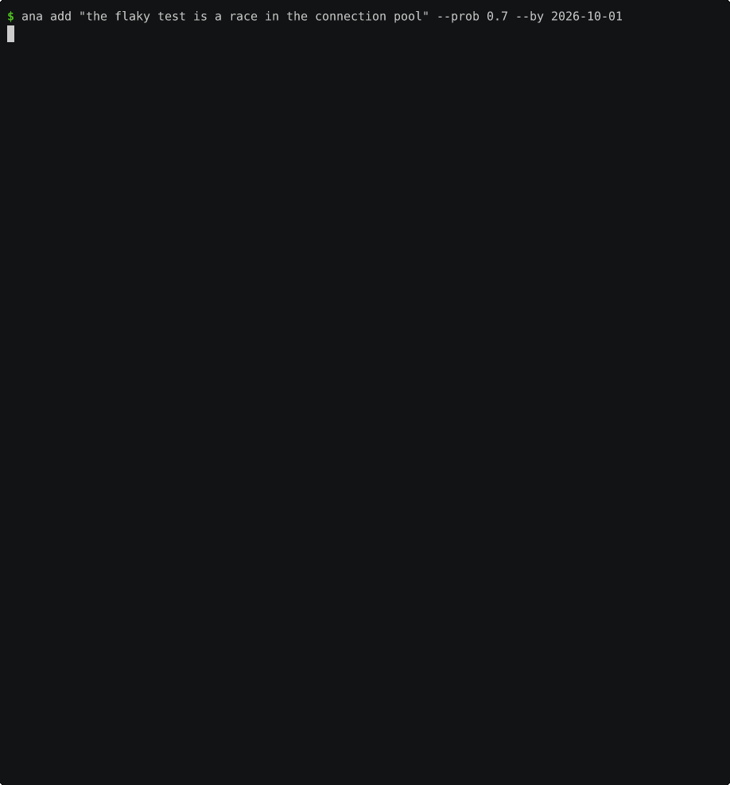

# Anamnesis

A local CLI for logging predictions before the outcome and checking whether your
"80% sure" comes true 80% of the time.

[](https://github.com/Anbu-00001/Anamnesis/actions/workflows/ci.yml)

<!-- Add crates.io / PyPI version badges only once those packages exist. -->

## What problem this solves

You remember being less surprised than you were. A prediction written down before
the outcome is the only version of your belief that hindsight cannot edit, so
Anamnesis stores that one and scores it. Forecasts are appended, never
overwritten, and the headline score always grades the **first** forecast on a
claim, which means revising a number after the evidence arrives cannot improve
your record. It runs locally, reads and writes one JSON file, and never uses a
model or the network to decide anything.

## Install

```bash
# from source
cargo install --git https://github.com/Anbu-00001/Anamnesis --locked

# or a prebuilt binary; installs nothing unless the release checksum matches
bash <(curl -fsSL https://raw.githubusercontent.com/Anbu-00001/Anamnesis/main/plugin/install-ana.sh)
```

## Try it

```bash
ana demo      # a fictional year of predictions, reported on. Touches nothing of yours.
ana add "this refactor takes under an hour" --prob 0.7 --by 2026-09-20
ana report
```

`ana demo` prints this, from a ledger it builds in a temporary directory:

<!-- BEGIN:report_head -->
```

ANAMNESIS — the shape of your judgement
=========================================

44 of 50 resolved (35 yes/no · 9 numeric)  ·  6 open  ·  first recorded 2025-01-19  ·  latest 2025-06-24

  Resolution discipline   88% graded (44 of 50)  ·  2 overdue
    ⚠ 2 claim(s) past due and ungraded — resolve them; until you do, the numbers below rest on a self-selected sample.
    Your ungraded calls are more CAUTIOUS than your graded ones (boldness 0.62 vs 0.76, ASMD 0.79) — your graded sample leans bold relative to what you actually predicted.

  VERDICT          NO MISCALIBRATION FOUND

  Brier score      0.272   (0 = perfect · 0.25 = always 50/50 · lower better)
                   scored on your FIRST forecast — the belief you recorded before the answer was known
                   on your final forecast it would be 0.268 (shown, not graded)
                   95% bootstrap band [0.180, 0.365] — how far luck alone could move it
  Stake-weighted   0.277   vs 0.272 flat → about the same across stakes
  Log score        0.793   (lower better; punishes confident misses)
  Brier skill      -0.112   (you did WORSE than always guessing the base rate)
  Lately           0.244   recent Brier vs 0.272 lifetime → improving  (last ~5 weighted; directional, not significant)
  Base rate        0.429   (fraction of your claims that came true)   95% CI 0.28–0.59

  Decomposition  (Brier = Miscalibration − Discrimination + Uncertainty)
    miscalibration 0.065   calibration error      ↓ lower is better
                   1.16x the 0.056 that only 1 calibrated forecaster in 20 exceeds on these same calls
    discrimination 0.037   sorting power          ↑ higher is better
    uncertainty    0.245   irreducible difficulty of your questions
    check          0.065 − 0.037 + 0.245 = 0.272  (= Brier, exactly — no bins, no tuning)
```
<!-- END:report_head -->

The rest of that report covers discrimination, the sequential evidence test, a
reliability diagram and a per-group breakdown. Bring an existing history with
`ana import history.csv` (columns: `statement, prob, created, resolve_by,
outcome, resolved_at, tags`).

## Demo



The same three commands, if you would rather read than watch:

```bash
ana add "the flaky test is a race in the connection pool" --prob 0.7 --by 2026-10-01
ana resolve <id> yes
ana report
```

## What it does, and what it does not

Does:

- Grades the forecast you recorded before the answer was known, never the one you
  revised afterwards. `ana update` is therefore safe to use freely.
- Reports calibration and discrimination separately. Knowing how sure to be and
  being able to tell true from false are different skills.
- Says whether an apparent miscalibration is real, with a test that stays valid
  even though you check it every session.
- Prints its own noise floor, so an error you cannot distinguish from luck is
  reported as exactly that.
- Prices ungraded claims into the evidence test rather than ignoring them, and
  says what the backlog is costing.

Does not:

- Talk to the network, at all. No telemetry, no account.
- Use a model to score anything. The engine is `std`-only arithmetic.
- Protect against you editing your own JSON. The threat model is hindsight bias,
  not tampering. See [docs/DATA_FORMAT.md](docs/DATA_FORMAT.md).
- Give a verdict below 20 graded calls, or ever describe you as calibrated on the
  strength of a quiet test. Absence of evidence is reported as absence of
  evidence.
- Claim to make you, or an agent, measurably better at anything. That is
  unmeasured.

Known limits: the evidence test is strong against sharp miscalibration and weak
against a gentle drift toward 50/50; several claims about one underlying event
are correlated and can mislead it. Both are quantified in
[docs/METHODS.md](docs/METHODS.md).

## For agents

`ana mcp` is a Model Context Protocol server exposing `predict`, `update`,
`resolve`, `calibration`, `recalibrate`, `decide`, `void`, `amend` and `list`.
[`plugin/`](plugin/) is a Claude Code plugin that injects your standing
calibration into each session and grades `kind:tests-pass` predictions from the
command's actual exit status. See [docs/AGENTS.md](docs/AGENTS.md).

## How this compares

Fatebook and Metaculus are better choices if you want to forecast with other
people, and Fatebook is open source. Calibration quizzes are a quick check on
trivia. This keeps a private record of the calls you make in your own work,
including the ones your coding agent makes.

| | Anamnesis | Fatebook | Metaculus | calibration quizzes |
|---|---|---|---|---|
| where the data lives | local JSON file | hosted service | hosted platform | nowhere |
| interface | CLI, MCP, editor hooks | web, API, Slack, extension | web, API | web page |
| questions | yours | yours | the community's | pre-written trivia |
| scoring basis | first forecast | latest forecast | time-averaged | instant |
| sequential evidence test | yes, anytime-valid | no | no | no |
| acts on the number | `ana decide` | no | no | no |
| account required | no | yes | yes | no |

## How this was built

I built this with Claude Code. Claude wrote most of the code and most of these
docs. My part was deciding what it should do and pushing back when Claude got it
wrong.

Claude was also the first user. While it worked, it logged its own predictions
(things like "the tests pass on the first run") and resolved them once the
answer came in, so the tool spent its development grading the thing that was
building it.

Before launch it went through a review that ran the binary the way a skeptical
user would, instead of reading the source. It found three problems the test
suite never caught. Revising a forecast after the outcome could earn a perfect
score. A forecaster who was wrong in both directions was reported as calibrated,
because the two kinds of error cancelled out. And 40 parallel writes could leave
as few as 7 claims saved. All three are fixed. The CHANGELOG has the numbers
from before, and `validation/repro.sh` runs each scenario against the current
build.

## Documentation

| | |
|---|---|
| [docs/METHODS.md](docs/METHODS.md) | every number, why it is that number, and the measurement behind it |
| [docs/AGENTS.md](docs/AGENTS.md) | the MCP server, the Claude Code plugin, auto-resolution |
| [docs/DATA_FORMAT.md](docs/DATA_FORMAT.md) | the ledger format and the threat model |
| [docs/DESIGN.md](docs/DESIGN.md) | why it is shaped this way, and the limitations |
| [docs/PYTHON.md](docs/PYTHON.md) | the scoring core as a Python library |
| [CONTRIBUTING.md](CONTRIBUTING.md) | build, test, and what CI checks |
| [CHANGELOG.md](CHANGELOG.md) | what changed, and what it changed from |

Every measurement in those docs has a script that reproduces it:

```bash
cargo test --all             # the suite, including the hostile-review scenarios
./validation/repro.sh        # the original defects, against a built binary
python3 validation/sims.py   # e-process power, CORP noise floor
python3 validation/ratio.py  # the two instruments, and the ratio threshold
```

## License

MIT. See [LICENSE](LICENSE).
