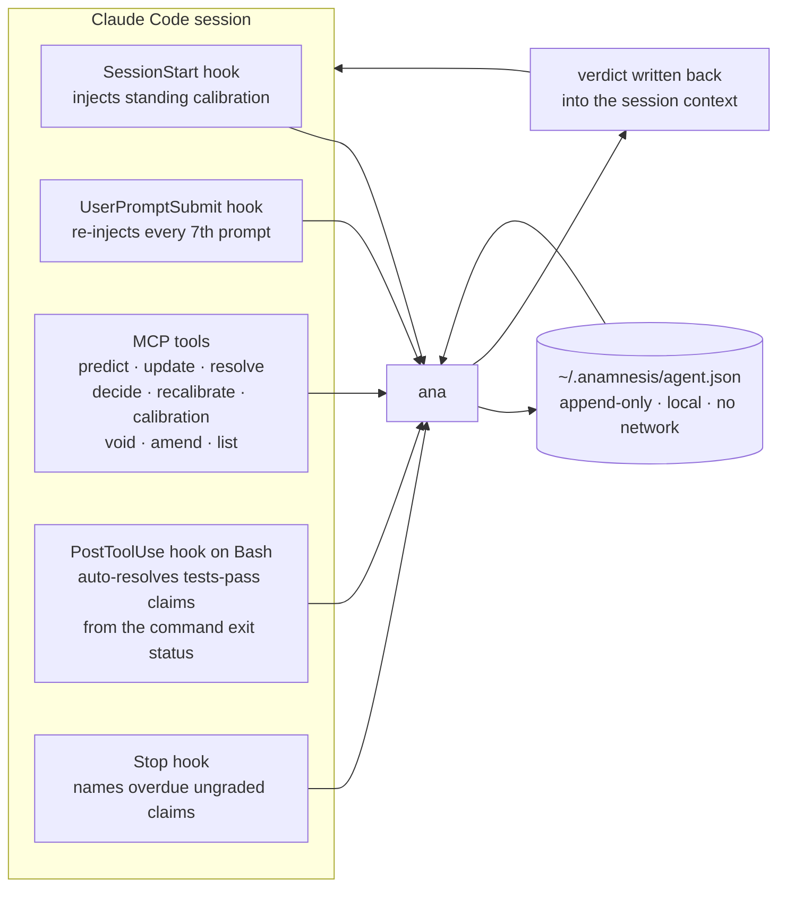

# For agents

## For agents: calibration that follows you everywhere

Most agent-memory tools record what happened. This one keeps score: whether the
agent's stated confidence matched what actually followed. Two surfaces ship in
this repo:

- **`ana mcp`** — a [Model Context Protocol](https://modelcontextprotocol.io)
  server over stdio exposing `predict` / `update` / `resolve` / `calibration` /
  `recalibrate` / `decide` / `list` as tools, so any MCP host (Claude, Cursor, Cline, …) can keep
  a calibration ledger *and act on it*:
  ```jsonc
  { "mcpServers": { "anamnesis": { "command": "ana", "args": ["mcp"] } } }
  ```
  The `decide` tool is the operational payoff: the calibration literature's sharpest
  finding about agents is that they *state* uncertainty yet take the irreversible
  action anyway. `decide` closes that loop — it discounts your stated confidence by
  your own track record, then returns **proceed / verify / abstain** against a
  stake-aware threshold, so high-stakes calls demand near-certainty before you commit.
- **A Claude Code plugin** ([plugin/](plugin/)) whose `SessionStart` hook injects
  your standing over/under-confidence into *every* project before you plan — e.g.
  *"OVERCONFIDENT +20pts; worst on kind:bug-hypothesis — add slack."* A companion
  `UserPromptSubmit` hook then re-surfaces that calibration as a **self-introspection
  checkpoint every 7th prompt**, nudging you to re-read the report and adjust
  mid-session — because the session-start banner is easy to forget twenty edits in.
  The mechanism is a deterministic counter rather than a reminder to try harder;
  see [DESIGN.md](DESIGN.md) for the reasoning and its sources.

  > **Tuning the cadence —** the checkpoint interval is controlled by the
  > `ANAMNESIS_INTROSPECT_EVERY` environment variable (**default `7`**). Raise it
  > (e.g. `15`) for fewer interruptions on long sessions, or lower it (e.g. `3`) to
  > be reminded more often. Set it in your `~/.claude/settings.json` `env` block, or
  > export it in your shell:
  >
  > ```bash
  > export ANAMNESIS_INTROSPECT_EVERY=10   # checkpoint every 10th prompt
  > ```

  Design notes: [docs/agent-plugin-design.md](docs/agent-plugin-design.md).

Three surfaces reach the same binary. Hooks fire on the session lifecycle, MCP
tools are called deliberately by the agent, and both read and write one local JSON
file; the current verdict is fed back into the session context so the next
estimate is made in light of the last hundred. Nothing leaves the machine.



Hooks are implemented in `src/hook.rs` (`ana hook <event>`), the tool surface in
`src/mcp.rs` (`ana mcp`). Both read the verdict from `report::verdict`, so a hook
cannot disagree with the report.

The `decide` gate is where a number becomes an action: your stated probability,
corrected by your own track record, then thresholded by what is at stake. The
mechanism, including what happens when the correction collapses, is in
[docs/METHODS.md](METHODS.md#5-the-decision-gate).

The bar **climbs with the stakes**: an ordinary call needs ≥ 80% to proceed; an irreversible one (`--stake 5`) needs ~96% — below that, the gate sends you to verify instead of letting you act on a hunch.

Both surfaces drive a global agent ledger at `~/.anamnesis/agent.json`
(`ANAMNESIS_AGENT_DATA`). Predictions carry a `kind:` tag so you learn *which type*
of call you misjudge — estimates, bug hypotheses, "tests pass first try".

---

## `resolve_by` is not optional in practice

The sequential evidence test orders claims by a date that is fixed before the
outcome is known. A claim with no `resolve_by` falls back to its creation date,
which works — but a real deadline is better, because it is the date you actually
expect to know, and it keeps a long-horizon prediction from sitting at the front
of the queue blocking everything behind it.

## Auto-resolution: the part that does not rest on your word

The `PostToolUse` hook watches for test and build commands and resolves any open
`kind:tests-pass` claim for the current project **from the command's exit status**,
recording `resolved_by: "auto"` and the command that produced it.

"Why would I trust a self-graded ledger?" is the first fair objection to this whole
idea. This is the part of the answer that is a number: the report shows what
fraction of your resolutions were graded by a machine rather than by you.

## Record the model

Pooling calibration across model versions makes the numbers uninterpretable. The
MCP `predict` tool takes a `model` argument, tagged `model:<value>`.

## Identity

Predictions are tagged `who:<client>`, derived from the MCP client's own name and
sanitized to `[a-z0-9-]`. Override with the `who` argument or `ANAMNESIS_WHO`.
It defaults to `who:unknown` rather than guessing.

## Supported MCP revisions

The server is **dual-era**. It answers both the modern stateless protocol and the
legacy handshake:

- **Modern**: `2026-07-28` — no `initialize`, per-request `_meta` carrying the
  protocol version and client info, and `server/discover` (which servers MUST
  implement). An unsupported version returns `UnsupportedProtocolVersionError`,
  code `-32022`, listing what is supported.
- **Legacy**: `2025-11-25`, `2025-06-18`, `2025-03-26`, `2024-11-05` via
  `initialize`. A version outside that list negotiates down to the newest
  supported one rather than being echoed back.
