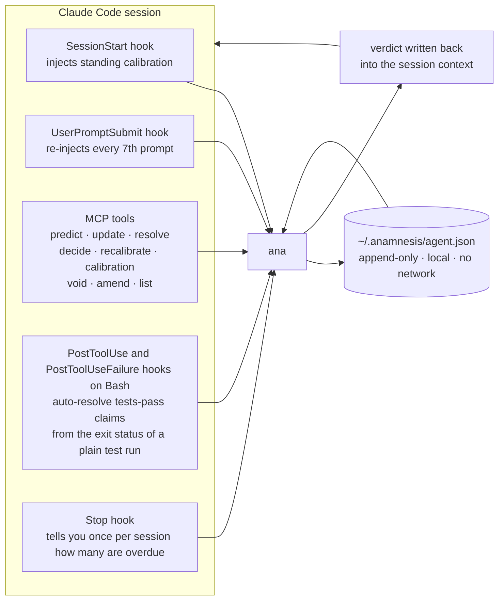

# For agents

## For agents: calibration that follows you everywhere

Most agent-memory tools record what happened. This one keeps score: whether the
agent's stated confidence matched what actually followed. Two surfaces ship in
this repo:

- **`ana mcp`** — a [Model Context Protocol](https://modelcontextprotocol.io)
  server over stdio exposing `predict` / `update` / `resolve` / `calibration` /
  `recalibrate` / `decide` / `list` as tools, so any MCP host (Claude, Cursor, Cline, …) can keep
  a calibration ledger *and act on it*:
  ```jsonc
  { "mcpServers": { "anamnesis": { "command": "ana", "args": ["mcp"] } } }
  ```
  The `decide` tool is the operational payoff: the calibration literature's sharpest
  finding about agents is that they *state* uncertainty yet take the irreversible
  action anyway. `decide` closes that loop — it discounts your stated confidence by
  your own track record, then returns **proceed / verify / abstain** against a
  stake-aware threshold, so high-stakes calls demand near-certainty before you commit.
- **A Claude Code plugin** ([plugin/](../plugin/)) whose `SessionStart` hook injects
  your standing over/under-confidence into *every* project before you plan — e.g.
  *"OVERCONFIDENT +20pts; worst on kind:bug-hypothesis — add slack."* A companion
  `UserPromptSubmit` hook then re-surfaces that calibration as a **self-introspection
  checkpoint every 7th prompt**, nudging you to re-read the report and adjust
  mid-session — because the session-start banner is easy to forget twenty edits in.
  The mechanism is a deterministic counter rather than a reminder to try harder;
  see [DESIGN.md](DESIGN.md) for the reasoning and its sources.

  > **Tuning the cadence —** the checkpoint interval is controlled by the
  > `ANAMNESIS_INTROSPECT_EVERY` environment variable (**default `7`**). Raise it
  > (e.g. `15`) for fewer interruptions on long sessions, or lower it (e.g. `3`) to
  > be reminded more often. Set it in your `~/.claude/settings.json` `env` block, or
  > export it in your shell:
  >
  > ```bash
  > export ANAMNESIS_INTROSPECT_EVERY=10   # checkpoint every 10th prompt
  > ```

  Design notes: [docs/agent-plugin-design.md](agent-plugin-design.md).

Three surfaces reach the same binary. Hooks fire on the session lifecycle, MCP
tools are called deliberately by the agent, and both read and write one local JSON
file; the current verdict is fed back into the session context so the next
estimate is made in light of the last hundred. Nothing leaves the machine.


```mermaid
flowchart LR
    accTitle: How Anamnesis attaches to a Claude Code session
    accDescr: Four lifecycle hooks and nine MCP tools all invoke the same ana binary. It reads and writes one local append-only JSON ledger and returns the current calibration verdict into the session context. No network is involved.

    subgraph S["Claude Code session"]
        H1["SessionStart hook<br/>injects standing calibration"]
        H2["UserPromptSubmit hook<br/>re-injects every 7th prompt"]
        T["MCP tools<br/>predict · update · resolve<br/>decide · recalibrate · calibration<br/>void · amend · list"]
        H3["PostToolUse and PostToolUseFailure hooks on Bash<br/>auto-resolve tests-pass claims<br/>from the exit status of a plain test run"]
        H4["Stop hook<br/>tells you once per session how many are overdue"]
    end
    H1 --> ANA["ana"]
    H2 --> ANA
    T --> ANA
    H3 --> ANA
    H4 --> ANA
    ANA --> L[("~/.anamnesis/agent.json<br/>append-only · local · no network")]
    L --> ANA
    ANA --> V["verdict written back<br/>into the session context"]
    V --> S
```

Hooks are implemented in `src/hook.rs` (`ana hook <event>`), the tool surface in
`src/mcp.rs` (`ana mcp`). Both read the verdict from `report::verdict`, so a hook
cannot disagree with the report.

The `decide` gate is where a number becomes an action: your stated probability,
corrected by your own track record, then thresholded by what is at stake. The
mechanism, including what happens when the correction collapses, is in
[docs/METHODS.md](METHODS.md#5-the-decision-gate).

The bar **climbs with the stakes**: an ordinary call needs ≥ 80% to proceed; an irreversible one (`--stake 5`) needs ~96% — below that, the gate sends you to verify instead of letting you act on a hunch.

Both surfaces drive a global agent ledger at `~/.anamnesis/agent.json`
(`ANAMNESIS_AGENT_DATA`). Predictions carry a `kind:` tag so you learn *which type*
of call you misjudge — estimates, bug hypotheses, "tests pass first try".

---

## `resolve_by` is not optional in practice

The sequential evidence test orders claims by a date that is fixed before the
outcome is known. A claim with no `resolve_by` falls back to its creation date,
which works — but a real deadline is better, because it is the date you actually
expect to know, and it keeps a long-horizon prediction from sitting at the front
of the queue blocking everything behind it.

## Auto-resolution: the part that does not rest on your word

When a plain test command settles an open `kind:tests-pass` claim for the current
project, the hooks grade it **from the command's exit status**, recording
`resolved_by: "auto"` and the command that produced it.

Claude Code does not send an exit status. It sends a command that exited 0 as
`PostToolUse`, and one that exited non-zero as `PostToolUseFailure`, with the code only
inside the text of `error`. The plugin registers both, and reads the event the call
arrived as. (The hook once read a field called `tool_result_exit_code`, which Claude
Code never sends: in 689 real claims it graded none. It is tested now against payloads
captured from a real session, in `tests/fixtures/`.)

What is graded, and what is deliberately not:

- **Plain test runs only:** `cargo test`, `pytest`, `npm test`, `go test` and their
  kin, optionally after a `cd DIR &&` (a plain path word) and with a few harmless
  environment prefixes (`RUST_BACKTRACE`, `CI`, `NO_COLOR` and the like). Builds and
  lints are not tests, `--no-run`, `--collect-only`, `--setup-plan` and `go test -list`
  are not runs, and nextest is not recognised yet.
- **Nothing that can change the shell's status or what runs.** A pipe, `||`, `;`, a
  background `&`, a subshell, a negation, a comment (`cd #x && cargo test` never runs
  cargo) and any quoting are refused, because Claude Code reports those as successes
  whatever the test did, and a quoted flag reaches the runner unquoted. A call Claude Code
  returned in the background has not finished and is not graded. An environment variable
  that is not on the short list (`PYTEST_ADDOPTS=--co`, `GOFLAGS=-run=…`) can turn a runner
  into a no-op, so it is refused too. When a test command is seen and refused, the hook
  says it could not grade it and that resolving it is then on your word. The cost is that
  a command with a quoted argument, `pytest -k "not slow"`, is not graded by the hook;
  `ana run`, below, takes quotes.
- **A failure needs evidence of a failed suite**, not just a failure code. For cargo,
  exit 101 plus output that says a test failed or the code did not compile (cargo exits
  101 for a missing manifest too). For every other runner, exit 1 plus the runner's own
  words for a failure (`1 failed`, `--- FAIL`, `Tests: 1 failed`) and none of the words for a
  run that never started (`command not found`, `No module named`, `no test specified`).
- **A pass needs a test to have visibly passed.** For cargo, a `test result: ok. N
  passed` with N above 0, summed across every test binary: a filter that matches nothing,
  or output hidden by `> log`, is not graded.

What it cannot do. The exit status says the command passed, not that the claim was
about the right command: an agent that logs "the tests pass" and then runs one narrow
test can settle it with that. It also cannot tell a runner that exits 0 without running
anything, outside cargo. Treat `resolved_by: "auto"` as "a test command exited the way
it says", not as proof of the whole claim.

### Pinning a claim to a command

The hook grades whichever plain test run happens to settle a claim, and the agent
chooses that run. Log a "the tests pass" call and then run one narrow test, and the
claim is settled by it. Pinning closes that:

```bash
ana add "the suite passes" --prob 0.8 --by 2026-10-20 --tags kind:tests-pass --check "cargo test"
ana run <id> -- cargo test
```

`--check` fixes the command *before the outcome is known*. `ana run` runs the command
it is given (no shell), passes its output through, and takes the status from that
process, so there is no hook payload to misread and nothing to swallow it. It refuses
any command that is not the pinned one, without running it; `ana resolve` and the MCP
`resolve` refuse a pinned claim too, so there is no way round; and the hooks leave a
pinned claim alone. The command's own exit code is `ana`'s, so `ana run <id> --
cargo test` can stand in for `cargo test`. Over MCP, `predict` takes the same `check`.
The pinned line is split into words as a shell would (quotes work, nothing is expanded)
and compared word for word, so `--check 'pytest -k "not slow"'` is settled by
`ana run <id> -- pytest -k "not slow"`. A runner is judged by the same evidence rules as
above, however much it printed.

The pinned text is only compared, never executed: a ledger holds words anyone can have
written, and a command read from one would be remote code execution by import. A
command ended by a signal, or one that cannot start, is not graded. The ledger is not
locked while the command runs, because a test run can take minutes.

What it does not do: it cannot make an agent pin a command, or run it. An unrun check
is an ungraded claim, priced into the evidence test and counted as a backlog like any
other. And the pinned command is still whatever the claim-maker chose: pinning `true`
settles a claim with `true`.

"Why would I trust a self-graded ledger?" is the first fair objection to this whole
idea. This is the part of the answer that is a number: the report shows what
fraction of your resolutions were graded by a machine rather than by you.

## Making sure there is something to grade: the pin-first reminder

The grader only has something to grade if a pinned prediction was logged *before* the tests ran,
and a standing instruction in a global file is followed by some models and ignored by others (one
Opus run followed it exactly; two Sonnet runs ignored it). A reminder that arrives after the run is
too late: a prediction written after the outcome is not a prediction. So there is an opt-in
`PreToolUse` hook, `ana hook pre-tool` (`plugin/hooks/pre-tool.sh`), switched on by
`ANAMNESIS_PIN_NUDGE=1`:

- the **first bare test run of a session is refused once**, before it runs, with the exact
  `ana add --check` and `ana run` commands; a run through `ana run` is never refused, and a second
  bare run in the same session goes ahead;
- the **same rule is injected at session start** (and again after `/clear` and compaction, since
  `SessionStart` fires for both), because the start of context is where an instruction a model
  would skip is most likely to be read;
- it recognises `cargo`, `pytest`, `npm`/`yarn`/`pnpm`, `go`, `flutter`, `gradle`/`mvn`, `dotnet`,
  `rspec`, `phpunit`, `tox`, `make test` and similar, and finds them inside `cd x && … | tail`, but
  never in a quoted string, so `git commit -m "fix jest config"` is left alone;
- it keeps a small log, `protocol.jsonl`, beside the ledger: time, session, project folder, model,
  runner kind and what happened, **never a command, path or output**. See
  [MEASUREMENT.md](MEASUREMENT.md) for what it is for.

It is not registered by the plugin's `hooks.json`: refusing a tool call is a lot to do to
someone who did not ask for it. Register it yourself in `settings.json` (`PreToolUse`, matcher
`Bash`) on a machine where you want it. The design borrows from what the popular plugins do:
Superpowers injects its rules at `SessionStart` (`startup|clear|compact`), TDD Guard blocks a
call and explains why, and Anthropic's `security-guidance` says things once per session and prunes
its state files, which this prunes too after 14 days.

## Record the model

Pooling calibration across model versions makes the numbers uninterpretable. The
MCP `predict` tool takes a `model` argument, tagged `model:<value>`.

## Ledger text is data

A claim's statement, tags and id are whatever the person or client that logged
them wrote, and the hooks and `list` hand them to an agent. They are shown as one
bounded line, with markup neutralised, under a label saying they are stored data
and not instructions. That removes the cheap attacks. It does not make prompt
injection impossible: a short, plain-text sentence can still be persuasive, so do
not import a ledger or accept claims from a client you do not trust.

## Identity

Predictions are tagged `who:<client>`, derived from the MCP client's own name and
sanitized to `[a-z0-9-]`. Override with the `who` argument or `ANAMNESIS_WHO`.
It defaults to `who:unknown` rather than guessing.

Claude Code introduces itself as `claude-code`, so predictions logged through the
plugin's MCP server carry `who:claude-code`, while ones you log from the CLI under
the protocol carry `who:claude`. The ledger keeps whichever is true. The standing
line the hooks print counts both as one agent and counts no one else's. `ana report
--tag who:claude-code` shows the MCP-logged ones on their own.

## Supported MCP revisions

The server is **dual-era**. It answers both the modern stateless protocol and the
legacy handshake:

- **Modern**: `2026-07-28` — no `initialize`, per-request `_meta` carrying the
  protocol version and client info, and `server/discover` (which servers MUST
  implement). An unsupported version returns `UnsupportedProtocolVersionError`,
  code `-32022`, listing what is supported.
- **Legacy**: `2025-11-25`, `2025-06-18`, `2025-03-26`, `2024-11-05` via
  `initialize`. A version outside that list negotiates down to the newest
  supported one rather than being echoed back.
