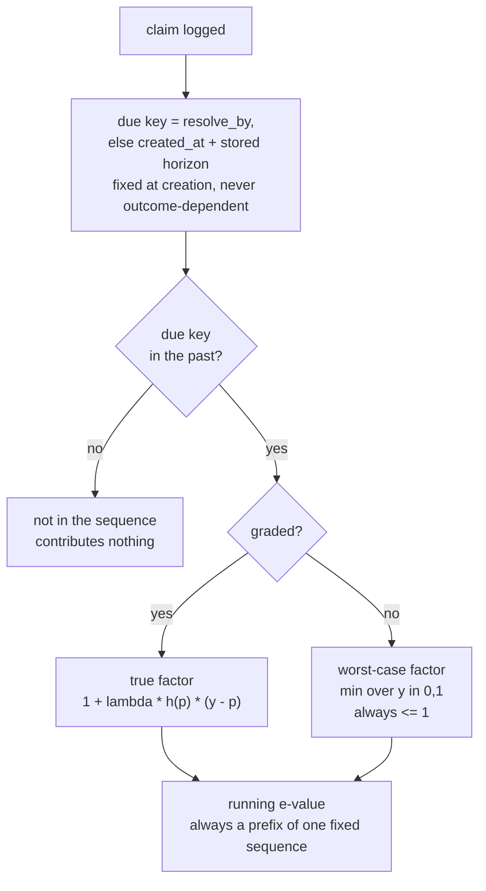
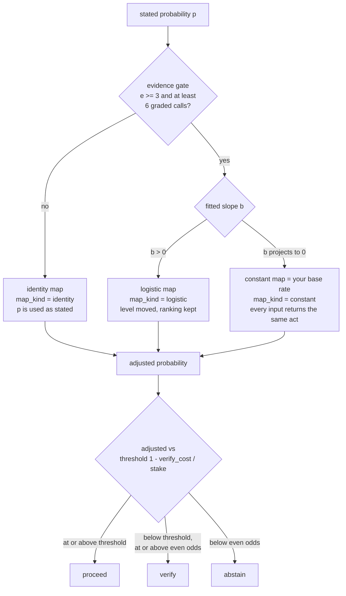

# Methods — what each number is, and why it is that number

Every figure quoted here came out of a script in [`validation/`](../validation/) or
a test in [`tests/hn_scenarios.rs`](../tests/hn_scenarios.rs). None of them is from
memory. If a claim here has no number behind it, it should not be here.

The scoring core ([`src/scoring.rs`](../src/scoring.rs)) is pure `std`: no I/O, no
network, no model. That is what makes it testable, and it is why the interesting
arguments below are all about *which* statistic to compute, not about the code.

---

## 1. Which forecast gets graded

**The first one.** The belief you recorded before you knew the answer.

The alternative — scoring your latest forecast — is what most tools do, and it is
trivially exploitable. Log ten claims at 0.5, update each to 0.99 once the answer
is obvious, resolve them all YES:

| scored on | Brier |
|---|---|
| final forecast | **0.000** |
| first forecast | **0.250** |

0.250 is the score for knowing nothing, which is exactly what those ten claims
demonstrate. The old behaviour also printed *"your updates moved you TOWARD the
truth. Good — you changed your mind well."*

Two secondary numbers are reported beside it, neither of them the headline:

- **`brier_final`** — the same score on your last forecast, labelled *not graded*.
  Useful for seeing whether you update in the right direction. Not a score,
  because a forecaster who learns the answer early can drive it to zero.
- **`brier_time_avg`** — each forecast weighted by how long it stood, the way
  Metaculus time-averages a question. It rewards updating *early*, which is a real
  skill. It is still secondary, for the same reason: the window closes at the
  earlier of the resolution and the end of the resolve-by day, so post-deadline
  revisions carry no weight, but an early-known answer can still be farmed.

**`late_updates`** counts revisions made after the deadline, within 24 hours of the
resolution, or in the last 10% of the claim's window. It is reported as a neutral
fact. A late update can be perfectly honest; the ledger cannot tell, so it does
not judge — it just declines to score it.

---

## 2. The decomposition: CORP, not exact-value grouping

`Brier = Miscalibration − Discrimination + Uncertainty`, computed by isotonic
regression (pool-adjacent-violators), following Dimitriadis, Gneiting & Jordan,
*Stable reliability diagrams for probabilistic classifiers*, PNAS 118(8) 2021
([doi:10.1073/pnas.2016191118](https://doi.org/10.1073/pnas.2016191118); the
preprint, [arXiv:2008.03033](https://arxiv.org/abs/2008.03033), carries the
earlier title *Evaluating probabilistic classifiers*).

- **MCB** = S(your forecasts) − S(isotonically recalibrated) — your calibration error
- **DSC** = S(base rate) − S(recalibrated) — how much your forecasts sort anything
- **UNC** = S(base rate) — the difficulty of the questions you chose

The identity holds **exactly**, with no bins and no tuning parameter. Measured
residual across every fixture in the test suite: `0.000e0`.

### Why the old version had to go

The previous decomposition grouped forecasts by their *exact* value, which made
its identity exact too — but at the sample sizes a person or an agent actually
has, most exact-value groups hold one or two claims, and a group of one has an
observed frequency of 0 or 1, so its "calibration error" is as large as it can
possibly be.

Simulated: a **perfectly calibrated** forecaster using two-decimal probabilities,
where the true calibration error is 0.000
([`validation/sims.py`](../validation/sims.py)):

| n | exact-value grouping | CORP MCB |
|---|---|---|
| 20 | 0.158 | 0.057 |
| 50 | 0.137 | 0.034 |
| 200 | 0.073 | 0.014 |
| 1000 | 0.017 | 0.004 |

The shipped number was telling well-calibrated users they had a calibration
problem. `reliability` and `resolution` remain in the JSON as deprecated aliases
for one release.

### The noise floor

MCB is fitted on the same data it scores, so it is never zero even for a perfect
forecaster. How far above zero depends on `n` and on the spread of your
forecasts — which nobody can hold in their head. So the report prints the floor
beside the value:

> miscalibration 0.034 — at or below the 0.050 a perfectly calibrated forecaster
> would score making these same calls

`mcb_null_q95` is the 95th percentile of MCB over 400 redraws of
`y ~ Bernoulli(p)` from *your own* forecasts, with a fixed seed so the number
never moves under a re-run.

---

## 3. The evidence test: is the miscalibration real?

An **e-process**: a betting martingale whose value is the wealth of a gambler
betting against the hypothesis that you are calibrated. By Ville's inequality it
exceeds `1/α` with probability at most `α` under the null **at any stopping
time** — so unlike a fixed-n test, it survives being looked at every session,
which is exactly how this tool is used.

- Arnold, Henzi & Ziegel (2023), *Sequentially valid tests for forecast
  calibration*, Annals of Applied Statistics 17(3):1909–1935
  ([doi:10.1214/22-AOAS1697](https://doi.org/10.1214/22-AOAS1697))
- Henzi & Ziegel, *Valid sequential inference on probability forecast
  performance*, Biometrika 109
  ([doi:10.1093/biomet/asab047](https://doi.org/10.1093/biomet/asab047))

Measured against a fixed-n alternative, peeking after every outcome, 1000 reps
([`bindings/python/validation/validate_guarantees.py`](../bindings/python/validation/validate_guarantees.py)):

| test | false-alarm rate (target ≤ 0.05) |
|---|---|
| e-process | **0.011** |
| naive z-test | **0.345** |

### 3a. Mixing betting strategies

The wealth process bets on `h(p)·(y − p)` for each of three strategies `h`:

| `h(p)` | catches |
|---|---|
| `1` | being too high, or too low, on the whole |
| `sign(0.5 − p)` | being too *sure*, in either direction |
| `2(0.5 − p)` | the same, weighted by how extreme the forecast is |

crossed with a grid of betting fractions λ, averaged in log space.

Every `h` depends only on the **stated forecast**, which is fixed before the
outcome — so each wealth process is still a non-negative martingale under the
null, and an average of e-processes over the same data is still an e-process.
Mixing costs validity nothing.

It is necessary because a single strategy is blind to *symmetric* overconfidence.
A forecaster who says 90% when the truth is 65% **and** 10% when the truth is 35%
has errors that cancel exactly:

| ledger | n | single strategy | mixture |
|---|---|---|---|
| symmetric 90/10 overconfidence | 1000 | **0.087** | ~10⁶⁵ |
| agent straddling 0.5 | 600 | **0.296** | ~10²⁹ |
| 90% coin flips + 60% sure things | 100 | **0.233** | **48.9** |
| calibrated forecaster (null) | 300 | 0.232 | 0.309 |

Power against symmetric overconfidence at n = 100 went from 2% to 100%, while the
null false-alarm rate stayed inside the bound (measured 0.0–2.3%).

That case is not exotic. It is what an agent looks like the moment it logs "this
will fail" at 0.15 alongside "this will pass" at 0.85.

### 3b. The order the evidence arrives in

Claims enter in order of their **due key**: their `resolve_by` date, or their
creation date plus a horizon **stored on the claim when it is created** (per
`kind:`, defaulting to 7 days). All of these are chosen before the answer is
known. A claim that is due but still ungraded is **priced**, not skipped and not
fatal: it contributes the smallest factor it could possibly have contributed.

Three mechanisms interact, and the diagram below is the whole of it: a key fixed
when the claim is written, a gate that admits nothing before that key has passed,
and a worst-case factor for anything admitted but still ungraded.



Implemented in `evidence_sequence`, [`src/evidence.rs`](../src/evidence.rs); the
factors are `calibration_log_eprocess_seq`, [`src/scoring.rs`](../src/scoring.rs).
The caption for the whole thing is Ville: every value this ever reports is bounded
by one fixed process, so how far along the sequence you happen to be looking, and
why you looked then, cannot matter.

#### Why that is sufficient

The reported e-value is always `M_k`, a **prefix product of one fixed sequence**.
Ville's maximal inequality bounds

```
P( ∃k : M_k ≥ 1/α )  ≤  α
```

over all `k` **simultaneously**. So it does not matter how `k` comes to be chosen,
or whether the choice correlates with the outcomes — every prefix is already
covered by the same bound. There is no separate "stopping time" condition to
discharge, and consequently no deadline gate is needed: the deadline was only ever
a way of *enforcing the prefix property*.

**Gaps extend this by one sentence.** For an ungraded claim the two factors it
could have contributed are `1 + λh(1−p)` (had it resolved YES) and `1 − λhp` (had
it resolved NO). Under the null the outcome is YES with probability exactly `p`,
so their `p`-weighted average is

```
p(1 + λh(1−p)) + (1−p)(1 − λhp) = 1
```

identically. A weighted average of two numbers is at least their minimum, so the
minimum is `≤ 1`, and it is also `≤` the true factor whichever outcome the claim
would have had. The gap-filled wealth is therefore pointwise `≤` the fully-graded
martingale at every `n`, and is itself a non-negative **supermartingale** starting
at `1`. Ville's inequality covers supermartingales, so the bound carries over
unchanged; across repeated views, whatever is ungraded at view time `t` still
satisfies `W'(t) ≤ M_n` for one fixed process `M`.

This is also precisely why the original code was wrong. Sorting by resolution time
does not produce a prefix of a fixed sequence — it produces **a different
sequence each time**, reordered by something the outcome touches. Ville says
nothing about that, because there is no single `M_k` to bound.

Everything else in this section follows from that argument rather than merely
supporting it.

#### Why the sequence no longer stops at the first gap

Stopping was a correct answer to the wrong question. Any prefix rule yields about
`(1−g)/g` usable claims for an ungraded rate `g`, so a ledger that is 35%
ungraded gets a **two-claim** sequence however much it holds. On a real 426-claim
agent ledger that meant **23 of 309** graded calls counted.

Partitioning does not rescue it. `K` partitions multiply the number of sequences
but each one is just as short, giving `K·(1−g)/g` — and the `K`-fold mixture
penalty cancels the power just bought. Monthly partitions on that ledger would
have given roughly 7 usable claims, *worse* than the 23.

Pricing the gap keeps every graded call in the test. Measured at n = 300, alarm
`e ≥ 20`, peeking every 5:

| graded | rule | usable n | P(detect) sharp | P(detect) diffuse | P(false alarm) |
|---|---|---|---|---|---|
| 100% | either | 300 | 1.000 | 0.587 | 0.013 |
| 90% | stop at gap | 10.1 | 0.047 | 0.000 | 0.000 |
| 90% | **gap-filled** | 270.1 | **1.000** | 0.217 | 0.000 |
| 65% | stop at gap | 2.0 | 0.000 | 0.000 | 0.000 |
| 65% | **gap-filled** | 194.7 | **1.000** | 0.003 | 0.000 |

"Sharp" is the symmetric pattern this mixture exists for (says 0.9 when the truth
is 0.65, 0.1 when it is 0.35); "diffuse" is a weaker alternative with per-claim
discrepancy ≤ 0.135. **Gaps are priced, not forgiven**: against the diffuse
alternative the cost of a 35% backlog is enough to eat the signal entirely. That
is a real limitation, and it is the honest form of the incentive — the backlog
costs you the ability to detect subtle miscalibration.

Two properties make the price well-behaved: with `|λ| ≤ 0.9` every factor is at
least `0.1`, so a gap costs wealth rather than zeroing the process; and the cost
scales with how bold the ungraded claim was, so an ungraded `0.95` costs more than
an ungraded `0.55`.

An undisciplined user's e-value therefore drifts down, meaning gaps can **hide**
miscalibration. They could already do that by freezing the test under the old
stopping rule, and neither direction can manufacture a false alarm.

#### Why there are two numbers, and what each one cannot see

The report runs two instruments on the same record, and **they fail in opposite
directions**. Stating that is the honest answer to "why not just one number".

| | what it answers | blind to |
|---|---|---|
| e-process (`Is it real?`) | is the miscalibration *real*, under repeated peeking | gentle shrinkage toward 0.5 |
| MCB vs its noise floor | how *big* the calibration error is | whether it is real — one reading is a single look |

The e-process is built from betting strategies on the stated forecast, so it is
strong exactly where the discrepancy per claim is large — the symmetric pattern
(0.9 when the truth is 0.65, 0.1 when it is 0.35) it exists to catch. It is weak
where every claim is off by a little in the same direction. Its power envelope
against that diffuse case is about **0.6 at n = 300 even with perfect grading** —
that is the test's ceiling, not a gap-filling artefact; gaps lower it further.

MCB against its null quantile is the complement: it measures a magnitude and will
show a uniform drift long before the sequential test says anything. But comparing
a statistic to its 95th percentile is a **fixed-n test**, and this program's whole
position is that fixed-n tests are invalid under the per-session peeking users
actually do. So MCB-above-floor is a reading to watch, never a verdict.

How often they disagree, at n = 200, 400 runs each
([`validation/ratio.py`](../validation/ratio.py)):

| forecaster | both quiet | MCB only | both fire |
|---|---|---|---|
| calibrated | 0.94 | **0.06** | 0.01 |
| diffuse, ≤13.5 pts off | 0.48 | 0.26 | 0.24 |
| sharp, 25 pts off | 0.00 | 0.00 | 1.00 |

A disagreement reading is about as likely to come from a calibrated forecaster as
from a miscalibrated one, so "worth watching, not settled either way" is the
accurate statement rather than a hedge.

**The 0.06 is arithmetic, not noise.** The floor is a 95th percentile, so a
calibrated forecaster crosses it one look in twenty *by construction*, and anyone
running `ana report` weekly crosses it within months with near certainty. That is
the peeking problem again, in the instrument with no anytime-valid protection. So
the crossing is not treated as an event at all: the report prints the **ratio** —
`calibration error 0.019, floor 0.014, 1.35x` — which carries the size, MCB's
entire job, and removes a threshold that repeated looking trips on its own. Prose
is reserved for `MCB_RATIO_NOTABLE = 1.5`, measured against the null:

| cut | calibrated | diffuse | sharp |
|---|---|---|---|
| ≥ 1.00 | 0.060 | 0.507 | 1.000 |
| ≥ 1.25 | 0.010 | 0.205 | 0.998 |
| **≥ 1.50** | **0.000** | 0.055 | 0.993 |

Read the floor correctly: it is the **95th percentile** of the null — a ceiling
only 1 calibrated forecaster in 20 exceeds — *not* what a calibrated forecaster
typically scores, which is `0.70–0.80x` it across n = 100..1000. Describing it as
a normal value would make every ratio read as less severe than it is, which
matters most in the 1.0–1.5 band. The report says "1.92x the 0.011 that only 1
calibrated forecaster in 20 exceeds" for exactly that reason.

The band below the prose cut is transient, and is meant to stay silent:

| n | median ratio (diffuse) | P(≥ 1.5) prose | P(1.0–1.5) silent | calibrated median |
|---|---|---|---|---|
| 100 | 0.87 | 0.025 | 0.258 | 0.70 |
| 200 | 0.95 | 0.033 | 0.408 | 0.73 |
| 500 | 1.25 | 0.250 | 0.542 | 0.75 |
| 1000 | 1.56 | 0.567 | 0.433 | 0.80 |

It peaks around n = 500 and drains upward as cases graduate into prose; by
n = 1000 the threshold catches about three fifths of diffuse miscalibration with
**no false prose at any n**. At moderate n the band holds calibrated forecasters
as well as drifting ones, so annotating it would assert more than the data
supports — the ratio is printed and the prose stays quiet.

**Consequently the report never renders "no evidence of miscalibration" as "you
are calibrated."** It used to: at n ≥ 50 the verdict line read `WELL CALIBRATED`,
the badge read `Well calibrated`, and the cat showed its happiest face. Measured
— a forecaster 10 points overconfident at n = 120 had MCB 0.019 against a 0.014
floor while the e-process sat at 5.4, far under the alarm at 20, and every surface
called that ledger well calibrated. This is finding B of the pre-launch audit
arriving by a different road, and the fix is not softer wording: a claim of
calibration now answers to **both** instruments, and when they disagree the report
says so and says which is which. Pinned by
`hn_scenarios::a_quiet_eprocess_never_speaks_for_the_calibration_error_too`, and
by `scripts/check-banned-phrases.sh` in CI: finding B arrived three times by three
different routes — the confidence gap, the verdict state table via a −1e-15
direction, and `label()` keying on `n` alone — so the phrase is now absent from
the program by construction rather than by care.

#### The horizon

The horizon answers "when is an answer fair to expect"; gap-pricing answers "what
if there still isn't one". They are separate questions and are now handled
separately.

Because a premature admission is now a small cost rather than a frozen test, the
horizon can be short enough to be useful. It is **stored on the claim at
creation** rather than computed at read time from a global, so the evidence order
is auditable from the file and cannot shift under an existing ledger when a
default changes. Measured resolution latency on the 426-claim agent ledger was
**median 6.6 minutes, p90 5 hours, p99 3.3 days**; the previous 30-day global
horizon held 130 already-resolved claims out of the sequence for nothing. The
default is now 7 days, with `kind:tests-pass`/`kind:bug-hypothesis` at 1 day and
`kind:estimate`/`approach`/`compat` at 3.

#### Measured anyway

A perfectly calibrated forecaster, one batch of 60 same-deadline claims, the
report re-read every 5 resolutions, alarm at e ≥ 20
([`validation/peeking.py`](../validation/peeking.py)):

| order | false alarms | median peak e |
|---|---|---|
| resolution time | **100%** | 443 |
| due key | **0%** | 1.24 |

For "will X happen by DATE" questions, YES tends to resolve the day it happens
while NO waits for the deadline, so every early prefix of the resolution-time
ordering is YES-heavy even for a perfect forecaster.

Note that at a *fixed* n none of this shows up — a product commutes, and two
ledgers with identical claims in shuffled resolution order return the same
e-value. That is why it hid for so long: the damage appears only under repeated
looking, which is the property being advertised.

#### Claims with no deadline

They are **included**, ordered by creation date plus a grace horizon
(`ANAMNESIS_HORIZON_DAYS`, default 30). Excluding them would have discarded every
claim in every ledger written before `--by` was encouraged — including all 35
graded claims in this tool's own demo ledger.

The grace horizon exists to remove a cliff. Admitted on the day it is written, a
single open no-deadline claim blocks everything created after it, so logging
"will we hit 10k users by 2028?" in week one freezes the evidence test forever.
With the horizon, that claim sits unadmitted until its key passes; a forgotten
one then starts applying pressure, which is the right nudge. The key is still
fixed at creation, so every reported value is still a prefix of a fixed sequence
and the argument above is untouched.

Stress-tested where resolution *speed* is perfectly correlated with the outcome —
the agent's normal case, since "the tests pass" is known in seconds and "the tests
fail" after an hour of debugging — peeking 200 times across 80 seeds:

| forecasts | n | false alarms |
|---|---|---|
| p ~ U(0.05, 0.95) | 200 | 0.0% |
| all p = 0.5 | 200 | 0.0% |
| all p = 0.9 | 200 | 1.2% |

#### The one operation that can break it: `void`

Voiding punches a hole in exactly this property, because it edits the sequence
after the fact.

- **Voided before it resolved** — safe. The claim carries no outcome, so removing
  it cannot move the e-value in any direction. Excluded from the sequence.
- **Voided after it resolved** — an outcome deleted from the record *after being
  seen*. The direction of abuse is self-flattery rather than a false alarm: you
  would void the ones that went badly, and the e-value would fall. Either way the
  prefix is no longer fixed.

So a claim voided after resolution **stays in the evidence sequence**, and the
report prints how many there are. The scores forget it — annulling a question is
what void is for — but the sequential test does not, and the edit is never
silent. If someone voids six resolved claims, the report says so out loud.

### 3c. Multiplicity

Per-`kind:` e-values search K subgroups for the worst one, which is K tests, not
one. A row must clear `20 × K` — Ville plus a union bound — before it is reported
as a finding. Below that the per-kind numbers are shown as descriptive only.

### 3d. Which grouping the breakdown uses

`kind:` and topic tags are the same feature wearing different names: both answer
"where in my record am I wrong?". So the per-group breakdown keys off **whichever
grouping the ledger actually populates** — `kind:` when it qualifies, otherwise the
best-covered namespace, with bare tags treated as a `topic` pseudo-namespace. A
human ledger gets `markets`/`tech`; an agent ledger gets
`tests-pass`/`bug-hypothesis`. Selection depends on tagging behaviour, never on
outcomes, so the evidence ordering and its guarantee are untouched.

Two bars, and the report says which one a collapsed section missed:

- **Coverage ≥ 50%.** A breakdown over a slice that happens to be tagged is a
  self-selected sample one level down. Measured: 363 of 422 binary claims on a real
  agent ledger carried no `kind:` tag.
- **2 ≤ K ≤ 12.** Every per-group e-value pays a factor of `K` in its alarm
  threshold. `session:` on that same ledger covers 100% of it and splits it into 66
  groups — a 66-fold penalty and an unreadable table; `who:` covers 100% with
  `K = 1`, which is not a breakdown at all. Bounding `K` excludes both without a
  hand-maintained list of "bookkeeping" namespaces.

The selection rule, stated so nobody has to wonder whether the grouping showing
the best result is the one that got picked:

1. `kind:` when it meets both bars.
2. Otherwise, among namespaces meeting both bars, **highest coverage wins, ties
   broken by namespace name ascending**.
3. Otherwise nothing is selected and the section collapses, naming which bar the
   best candidate missed.

Coverage and `K` are functions of tagging alone, never of outcomes, so validity
holds either way; writing the rule down and sorting explicitly is what makes that
checkable rather than merely true. Pinned by the tie-break case in
`hn_scenarios::the_breakdown_keys_off_whatever_the_ledger_populates_or_says_why_not`.

`K` is printed in the header (`By kind (K=2 groups · 100% covered)`) because it
sets the multiplicity-corrected alarm, and a threshold nobody can see is a
threshold nobody can check.

### 3e. The assumption, stated plainly

The guarantee needs each outcome to be calibrated **given the earlier ones**.
Several claims about one underlying event are correlated and can trip the test
even for a well-calibrated forecaster. Log one claim per event, or group them
under a `group:` tag and read the per-group numbers.

---

## 4. The verdict

One function, [`report::verdict`](../src/report.rs), is the only thing that decides
whether you are calibrated. The plain report, the cat, the badge, the HTML card,
`--json`, the MCP `calibration` tool and the hooks all read it.

| state | condition |
|---|---|
| `insufficient_data` | fewer than 20 graded calls |
| `no_evidence_of_miscalibration` | MCB at or below its floor, e below 20 |
| `calibrated_but_uninformative` | the above, and DSC ≈ 0 |
| `overconfident` / `underconfident` | e ≥ 20, MCB above floor, with a clear direction |
| `biased_yes` / `biased_no` | as above, with a directional lean dominating |
| `miscalibrated_both_ways` | as above, but the gap is too small to name a direction |

The words "well calibrated" never appear at all — see 3b, "why there are two
numbers" — and no verdict appears below 20 graded calls.

**Why the confidence gap is not the verdict.** The gap is `mean(boldness) −
accuracy`, an aggregate — and aggregates cancel. A ledger of 50 calls at 0.9 on
coin flips plus 50 at 0.6 on sure things has a Brier skill of −0.520, a
calibration error of 0.160, DSC of exactly 0.000 — and a confidence gap of
−0.000000000000001. Every surface keyed off that gap, so all of them announced
`[DIALED IN] · well calibrated` and advised "keep doing what you're doing".

`miscalibrated_both_ways` exists for the same reason: on that ledger the sign of
the remaining gap is floating-point noise, and the direction it happened to give
("underconfident") would have sent the reader to raise the very 0.9s that were the
problem.

---

## 5. The decision gate

Recalibrate the stated probability, then apply Chow's reject rule:

```
τ = 1 − verify_cost / stake      proceed iff p̂ ≥ τ ;  abstain below even odds
```

The correction is evidence-gated: until the e-process has found real evidence
(`e ≥ 3` over at least 6 graded calls) the identity map applies and your number is
used exactly as stated. Once it has, the fitted map moves the level but cannot
invert your ranking, because the slope is constrained to be non-negative. When
that constraint binds, the map collapses to a constant and every stated
probability returns the same act — which is correct, looks exactly like a bug, and
is therefore reported as `map_kind`.



Implemented in `decide` and `gate_recalibration_seq`,
[`src/scoring.rs`](../src/scoring.rs); the gate the CLI and the MCP tools share is
`earned_recalibration`, [`src/report.rs`](../src/report.rs).

- Ferrer & Ramos, *Evaluating Posterior Probabilities: Decision Theory, Proper
  Scoring Rules, and Calibration*, TMLR 2025
  ([arXiv:2408.02841](https://arxiv.org/abs/2408.02841))
  — **not** to be confused with Ferro & Fricker (2012), *A bias-corrected
  decomposition of the Brier score*, QJRMS
  ([doi:10.1002/qj.1924](https://doi.org/10.1002/qj.1924)), which is a different
  paper by different authors on a different subject. The near-homonym is the exact
  shape of citation error that gets torn apart, so both are named here.

  That paper argues calibration metrics capture only one aspect of posterior
  quality, ignore discrimination, and should play no role in assessing posteriors.
  This design agrees with the premise and answers it structurally: **the headline
  is a proper scoring rule** (Brier), and CORP reports discrimination *alongside*
  calibration rather than instead of it — which is why `DSC ≈ 0` outranks any
  statement about the level. See §4.

The correction is **evidence-gated**: `scoring::gate_recalibration` hands the
number back unchanged until the e-process finds real evidence of miscalibration,
so it will not "correct" on noise. That gate is one function, shared by the CLI,
both MCP tools and the Python binding.

Measured, 300 reps of an overconfident agent at n = 600, stake 3, verify cost 0.6:

| policy | mean decision cost |
|---|---|
| act on the raw stated number | 0.6556 |
| recalibrate, then threshold | **0.6005** |

The gate is cheaper in 100% of runs.

### The recalibration fit

`p ↦ σ(a + b·logit p)`, fitted by ridge-penalised logistic regression with damped
Newton and a backtracking line search.

The line search is not decoration. Undamped Newton **diverges** whenever the fit
wanders into the saturated region: there every `mu` is ~0 or ~1, so the Hessian
weights `mu(1−mu)` vanish while the gradient does not, and each step overshoots
further. Measured on 200 calls all stated at 0.9 that came true half the time — an
agent with a narrow confidence vocabulary — it returned `a = 66, b = 146`: a map
that corrected 0.9 **up to 1.0** for a forecaster who was right half the time.
With the line search it returns 0.498, against a truth of 0.5. If the solver does
not converge, the identity map is returned instead: "no correction" is the honest
answer when the fit will not settle, and a confidently wrong one is not.

#### The assumption: `b ≥ 0`

The slope is **constrained to be non-negative** by projecting each Newton step
onto `b ≥ 0`. This is an assumption, and it is stated here rather than left to be
inferred from the code:

> `b ≥ 0` asserts that the forecaster's **ranking is not inverted** — that the
> calls you were surer about were not systematically *less* likely to come true.

The justification is that this is exactly what the isotonic (PAV) fit does with
the same data. Isotonic regression is monotone non-decreasing by construction, so
it cannot express an inverted ranking either; when the data are anti-correlated it
returns a flat curve at the base rate. Constraining `b` makes the parametric map
agree with the non-parametric one it is checked against, instead of being free to
do something the oracle cannot.

What is given up is real but small: a genuinely anti-calibrated forecaster is
*not* corrected by flipping their probabilities. That is deliberate. Flipping is
a much stronger claim than the data at these sample sizes supports — the fit that
motivated this constraint found `b = −0.69` on `n = 15`, which is noise — and a
map that inverts you is the single worst failure mode for an instrument whose
output is fed to a decision gate.

The honest division of labour is that **MCB and DSC report the inversion, and the
map declines to act on it**. When the ranking is inverted, `b` projects to `0`,
the map collapses to a constant, and `DSC ≈ 0` is reported: *your forecasts do not
sort outcomes*. Fixing the ranking is the user's job; the map's job is to not make
a confident correction it has not earned.

#### The collapsed map must announce itself

Once `b = 0`, `decide --prob 0.99` and `decide --prob 0.55` return the same act,
because the stated probability is no longer an input. That is correct behaviour
and indistinguishable from a bug at the call site, so the shape of the map is
reported explicitly as `map_kind`:

| `map_kind` | meaning |
|---|---|
| `identity` | no correction earned yet; your number is used as stated |
| `logistic` | fitted `σ(a + b·logit p)`, `b > 0` — ranking kept, level moved |
| `constant` | `b = 0`; your confidence did not track outcomes, so it was replaced by your base rate |

It appears in `ana decide --json`, in the MCP `decide` tool's result, and as a
line of prose in the text output when it is `constant`.

---

## 6. Intervals

For a numeric claim you record a credible interval at a stated level. The
**Winkler interval score** (Winkler 1972) charges the width plus a miscoverage
penalty.

The headline is the **unitless ratio** `winkler / width`: `1.00` means the value
landed inside, and anything above is the miss penalty in multiples of your own
stated width. The raw score carries the units of whatever is being predicted, so
averaging it across claims let one question measured in dollars dominate one
measured in milliseconds. Raw Winkler is still shown per claim in `ana show`.

**`conformal_width_factor`** is the split-conformal quantile of standardized
residuals: the multiplier on your half-widths that would make your coverage hit
its nominal level. It is gated on the coverage e-process, which reuses the binary
test with `prob = level, outcome = contained`.

CRPS is deliberately not implemented: for the interval format recorded here, the
Winkler score already *is* its specialisation (WIS → CRPS as the number of
intervals grows), and CRPS needs a distribution shape that was never recorded.

---

## 7. Everything else

| number | what it is |
|---|---|
| **Brier score** | mean squared error of your probabilities. 0 perfect, 0.25 = always saying 50/50 |
| **Log score** | punishes confident misses far harder; `eps = 1e-6` clamps p to keep it finite |
| **Brier skill** | `1 − brier/uncertainty`. Negative means you did worse than always guessing the base rate |
| **AUC** | rank-based discrimination, ties handled. 0.5 = your confidence sorts nothing |
| **Bootstrap band** | 2000 seeded resamples of the Brier — how far luck alone could move it |
| **EWMA "lately"** | recency-weighted Brier, half-life 5. **Descriptive only**, not a control chart: an alarm at an agent's n would false-alarm constantly |
| **Wilson interval** | small-n interval on the base rate |
| **Risk–coverage** | error among your most-confident calls vs all — when to trust your own judgement |
| **Stake-weighted Brier** | are you miscalibrated on the calls that *matter*? |
| **`asmd`** | standardized difference in boldness between graded and ungraded calls — the missing-not-at-random check |
| **`dialectical_mean`** | averages a first estimate with a deliberate "consider the opposite" second (Herzog & Hertwig 2009). An elicitation aid, not a score |

## 8. Deliberately not built

- **CRPS** — see §6.
- **CUSUM / control-chart alarms, and Adaptive Conformal Inference** — both
  false-alarm at the sample sizes this tool actually sees. The EWMA line is
  descriptive, and the pooled conformal factor is more stable than ACI's
  learning-rate knob.
- **An exact incomplete-beta coverage interval** — Wilson is within a hair of
  Jeffreys at small n, and the e-process is the better peek-proof gate anyway.
